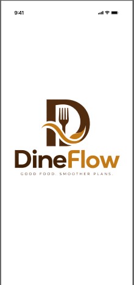

# DineFlow - Restaurant Table Reservation & Queue System



DineFlow is a full-stack restaurant table reservation and queue management solution consisting of two Expo React Native mobile applications sharing a Node.js/Express backend API and a Supabase database project.

---

## 🚀 Latest Releases (v1.0.0) & APK Downloads

You can download the compiled standalone Android APKs directly from the [Official GitHub Release v1.0.0](https://github.com/LakviduUpasara/restaurant-table-reservation-and-queue-app/releases/tag/v1.0.0):

| Application | Description | Direct APK Download |
| :--- | :--- | :--- |
| 📲 **DineFlow Customer App** | Table reservations, live queue status, menu & pre-orders | [Download Customer APK](https://expo.dev/artifacts/eas/67gTZnYk5W6iDZU9pXgoCw2jy2KagxPxqRyxFuxkFSM.apk) |
| 🛠️ **DineFlow Operations App** | Restaurant staff management, walk-ins, queue & table management | [Download Operations APK](https://expo.dev/artifacts/eas/gIqkcyGQ5sZR67wJ5hq1a_YfgI0aon2bM_7FSQ0llYE.apk) |

---

## 📱 Features & Applications

### 1. Customer Application (`apps/customer-app`)
- **Authentication**: Customer registration, login, and password reset flows (`dineflow-customer://reset-password`).
- **Table Reservations**: Select date, time, and party size with real-time table availability.
- **Live Queue System**: Join virtual queue, view live position and estimated wait times.
- **Menu & Pre-orders**: Browse restaurant menu items, customize orders, and pre-order meals for reservations.
- **Brand Experience**: Custom DineFlow brand icon and responsive splash/loading screen (`#FFFFFF` background).

### 2. Operations Application (`apps/operations-app`)
- **Staff Access & Roles**: Owner & Staff authentication (`dineflow-operations://reset-password`).
- **Queue & Table Management**: Live table status map, assign walk-ins, mark tables ready/occupied.
- **Staff & Product Settings**: Manage restaurant staff invitations, menu items, and booking rules.
- **Brand Experience**: Matching DineFlow brand icon and responsive splash/loading screen (`#FFFFFF` background).

### 3. Backend API & Cloud Infrastructure (`backend`)
- **Live Backend Deployment**: Deployed on Vercel at `https://restaurant-table-reservation-and-queue-app.vercel.app/api`.
- **Database & Auth**: Hosted Supabase project with Realtime subscriptions, RLS security policies, and Auth services.

---

## 🛠️ Requirements & Setup

### Prerequisites
- **Node.js**: `v22.13+` and `npm`
- **Supabase**: Hosted Supabase project
- **Expo / EAS CLI**: Expo SDK 57

### Local Setup Instructions

1. **Install Dependencies**:
   ```bash
   npm install
   ```

2. **Database Setup**:
   - Apply `supabase/migrations/20261002000100_core.sql` in your Supabase SQL Editor.
   - Run `supabase/seed.sql` to populate demo restaurant, tables, and menu data.

3. **Environment Variables Configuration**:
   - Create `backend/.env`:
     ```env
     SUPABASE_URL=https://<your-supabase-project>.supabase.co
     SUPABASE_PUBLISHABLE_KEY=<your-publishable-key>
     SUPABASE_SECRET_KEY=<your-secret-key>
     PORT=3000
     ```
   - Create `.env` in `apps/customer-app` & `apps/operations-app`:
     ```env
     EXPO_PUBLIC_SUPABASE_URL=https://<your-supabase-project>.supabase.co
     EXPO_PUBLIC_SUPABASE_PUBLISHABLE_KEY=<your-publishable-key>
     EXPO_PUBLIC_API_URL=https://restaurant-table-reservation-and-queue-app.vercel.app/api
     ```

4. **Running Development Servers**:
   - Backend API: `npm run api` (Port 3000)
   - Customer App: `npm run customer` (Port 8081)
   - Operations App: `npm run operations` (Port 8082)

---

## 🧪 Testing & Verification

- **Type Check**: `npm run typecheck` (Verifies TypeScript across all workspaces)
- **Unit & Integration Tests**: `npm run test`
- **Hosted Database Verification**: `npm run check:hosted-db`

---

## 🏗️ EAS APK Build Commands

To build standalone APK files for both applications using EAS Cloud Build:

```bash
# Build Customer App APK
cd apps/customer-app
npx eas build -p android --profile preview

# Build Operations App APK
cd apps/operations-app
npx eas build -p android --profile preview
```

---

## 📄 License & Traceability

- See [Implementation Traceability](docs/04_IMPLEMENTATION_TRACEABILITY.md)
- See [Functional Test Cases](docs/05_TEST_CASES.md)
- See [Validation Status](docs/07_VALIDATION_STATUS.md)
